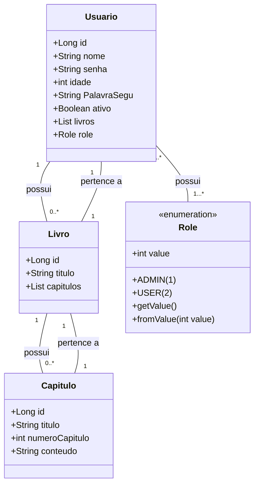

# DiarioDigital_Monorepo

O projeto **DiárioDigital** surgiu como parte da disciplina de testes de software. O objetivo inicial da disciplina era apenas introduzir os alunos à prática de realizar testes em seu código. No entanto, com o decorrer da disciplina, o escopo do projeto se expandiu, passando de uma simples aplicação **Java** para uma plataforma completa. O **Back-End** foi desenvolvido em **Java**, utilizando o **framework Spring Boot**, enquanto o **Front-End** foi construído com **HTML**, **TypeScript** e **CSS**, contando com o apoio do **framework Angular**.

## Repositórios
- **DiarioDIgital** : [https://github.com/LucianoSegundo/DiarioDIgital](https://github.com/LucianoSegundo/DiarioDIgital)
- **DiarioDIgital** : [https://github.com/LucianoSegundo/DiarioDigital-Front-End](https://github.com/LucianoSegundo/DiarioDigital-Front-End)
- **Hospedado da Plataforma** : A plataforma pode ser testada [clicando aqui](https://diariodigital-front-end.onrender.com). A plataforma podera ser testada durante 30 dias, contanto apartir de **15/03/2025**, esse é o tempo de duração do banco de dados gratuito fornecido pela plataforma de hospedagem;
- **Hospegagem da API** : A documentação da API pode ser acessada [clicando aqui](https://diariodigital-2.onrender.com/swagger-ui/index.html), assim comoa plataforma, só estará disponivel pelos proximos 30 dias, contando apartir do dia ***15/03/2025*. OBS: è politica do fornecedor da hospedagem gratuita desligar o servidor caso ele passe alguns minutos sem receber nenhum acesso, o servidor é restartado quando recebe uma nova requisição, oque leva um tempo para acontecer.

## Diagrama de Classes

## Imagens da Plataforma

### Homepage Parte 01

### Homepage Parte 02: Cadastro

### Pagina de Login

### Pagina de Login Aguardando resposta do Back-End

### Pagina de Login Negado

### Pagina de Recuperação de Senha

### Pagina Principal Sem Nenhum Livro

### Pagina Principal + Criação de Livro

### Pagina Principal com Livro

### Pagina do Livro Selecionado sem Capitulos

### Pagina de Exclusão de Livros

### Pagina de Criação de Capitulos

### Pagina do Livro Selecionado com Capitulos

### Pagina de Leitura de Capitulo

### Pagina Pagina de Exclusão de Capitulo + Aviso de Fim de Sessão

### Pagina de Exclusão de Conta

## Banco de Dados
Em produção foi usado um banco PostGreSQL, o banco fornecido pelo serviço de hospedagem gratuita.
Contudo em Desenvolviemento foi usado um Banco MySQL, com o qual era inicialmente projetado para trabalhar.

## Ferramentas Utilizadas
- Swegger
- MySql
- PostgresSQL
- Spring Data JPA
- Spring Web
- Spring Security
- JWT
